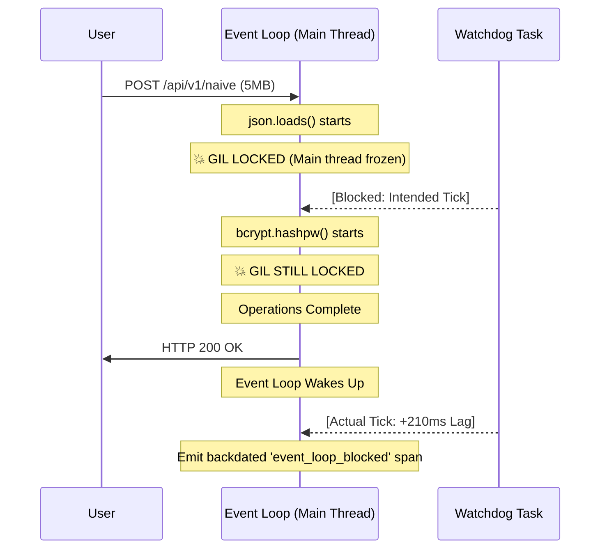
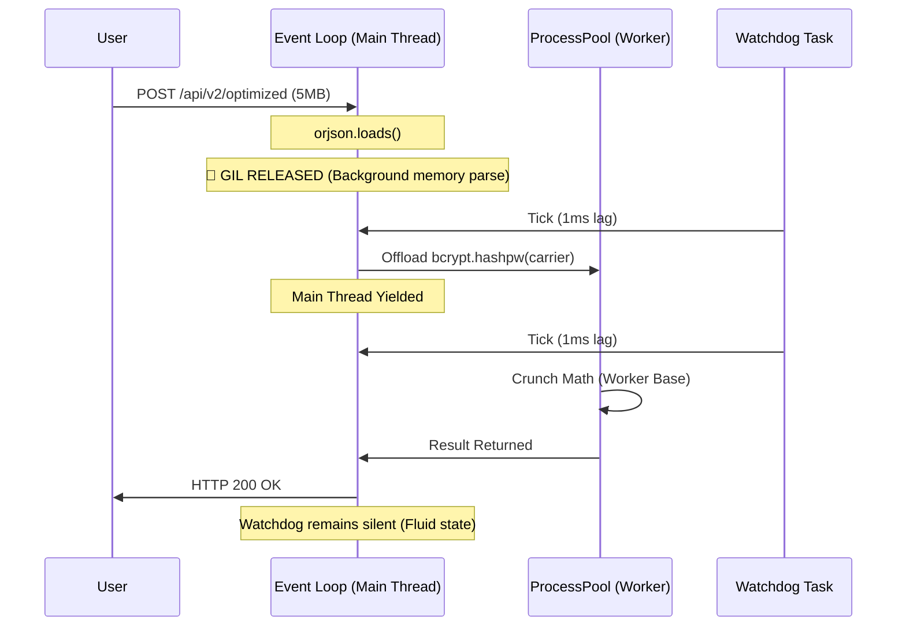

# fastapi-gil-guardian

Welcome to the **fastapi-gil-guardian**, a powerful blueprint and engineering document that showcases how to manage both I/O and CPU tasks in Python effectively. This project clearly illustrates, through real-world observation, how to step around the Global Interpreter Lock (GIL) and keep a smooth event loop functioning even under intense pressure.

## The Bottleneck: The Cooperative Contract and the GIL

The Python `asyncio` framework relies on a "Cooperative Contract." This means tasks need to promptly and willingly hand back control to the event loop. Since the event loop operates on a single thread, its primary responsibility is to manage network I/O and schedule tasks effectively.

However, two primary "silent killers" routinely break this contract in standard FastAPI applications:
1. **Large JSON Payloads:** The usual Python `json` library functions as a synchronous C-extension. When it comes to breaking down a hefty 5MB payload, it keeps the Global Interpreter Lock (GIL) tied up, causing issues throughout the process.
2. **Cryptographic Hashing:** Libraries such as `bcrypt` are purposely made to be CPU-heavy, featuring a Work Factor. Running `bcrypt.hashpw` in the main thread does not return control, keeping the GIL locked up.

During these operations, you encounter the dreaded **0% CPU Freeze**. One core is completely occupied, either crunching numbers or parsing strings, while the event loop struggles to schedule *any* additional tasks. As a result, concurrent requests pile up endlessly, leading to significant latency spikes throughout your entire API, even though the overall system usage appears low.

## Event Loop Telemetry

In this domain, observability is not a luxury; it is the absolute proof of architecture. To visualize the exact moment the Cooperative Contract is broken, we implemented the **"Trap Hook" Watchdog**.

To expose the silent killer, we deployed a background daemon task that runs a continuous heartbeat: `await asyncio.sleep(0.01)`. 

The watchdog measures the difference between when it was supposed to wake up and when it actually does, using `time.perf_counter()` for accurate timing. If this difference, or lag, goes over a strict 50ms limit, it indicates that the GIL was locked. In response, the watchdog creates a manual OTel span labeled `event_loop_blocked`. Importantly, it **backdates** this span's start time to fully account for the "idle time," raising a noticeable red flag on your distributed tracing Gantt charts.

### Visual Evidence: The "Frozen" vs. "Fluid" Event Loop

By load-testing our intentionally broken `/api/v1/naive` endpoint and our GIL-safe `/api/v2/optimized` endpoint, the telemetry reveals the exact architectural difference.

#### 🔴 The Naive Architecture (GIL Blocked)


#### 🟢 The Optimized Architecture (Fluid)


## Surviving the Void: ProcessPool Context Propagation

Asyncio offers concurrency, but to take advantage of multiple cores and avoid the GIL for demanding calculations, you have to implement multiprocessing using `ProcessPoolExecutor`. Yet, each process operates in its own memory space. If you just send a task to a worker process, your OpenTelemetry trace context will get disrupted.

A distributed trace that gets interrupted at a process boundary isn't accurate. Moreover, **background threads, such as OTel's `BatchSpanProcessor`, do not carry over across Python multiprocessing boundaries (fork/spawn).** To preserve the parent-child span connection, the trace context must be explicitly serialized, sent across the IPC boundary, extracted by the worker, and the worker needs to set up its own Telemetry Exporter.

Here is the exact OTel context propagation trick used:

```python
# 1. Main Process: Inject context into a picklable carrier
carrier = {}
propagate.inject(carrier)

# 2. Yield to the ProcessPool (The GIL is safe!)
hashed_password = await loop.run_in_executor(
    process_pool, 
    worker_hash, 
    carrier,         # Pass the serialized OTel context
    password_str
)

# 3. Worker Process (Re-hydration)
def worker_hash(carrier: dict, password_str: str) -> bytes:
    # A) Bootstrapping Exporter: Background threads don't survive IPC!
    provider = TracerProvider()
    processor = BatchSpanProcessor(ConsoleSpanExporter())
    provider.add_span_processor(processor)
    trace.set_tracer_provider(provider)
    
    # B) Extract the trace context from the carrier dictionary
    ctx = propagate.extract(carrier)
    # C) Resume the trace
    with worker_tracer.start_as_current_span(..., context=ctx):
        ...
```

## How to Run & Verify

### 1. Setup Environment
```bash
pip install -r requirements.txt
```

### 2. Launch the Guarded API
```bash
python main.py
```

### 3. Run the Benchmarks
```bash
python load_test.py
```

Watch your console output while running the phase 1 load test. You'll notice the server showing warnings like `GIL Freeze Detected!` as the simplistic endpoint disrupts your event loop, while Phase 2 stays fully responsive.

---
*Note: This repository acts as a solid foundation for handling mixed I/O and CPU applications in Python. Follow the Cooperative Contract, let go of the GIL during serialization, and carry the context through the gaps.*
